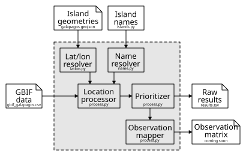

# Galápagos Island Mapper

A pipeline for building a curated database of Galápagos museum specimen records from [GBIF](https://www.gbif.org/) occurrence data. It assigns each record to a specific island, filters out mainland Ecuador contamination, applies Galápagos-specific taxonomic corrections, and produces species × island summary tables ready for analysis.

**Maintainer:** Jack Dumbacher — jdumbacher@calacademy.org  
**Institution:** California Academy of Sciences

---

## What it does

1. **Downloads** Ecuador specimen occurrence records from GBIF (~2.3 million records)
2. **Assigns** each record to a specific Galápagos island using GPS coordinates and/or locality text
3. **Filters** out mainland Ecuador records that the island resolver incorrectly flags as Galápagos
4. **Corrects** species names using a Galápagos-specific taxonomic thesaurus (GBIF backbone + AviList 2025 + CDF checklist), including synonym resolution and island-informed name corrections
5. **Outputs** clean TSV files and species × island summary tables for four vertebrate classes (birds, mammals, tortoises, squamates)



---

## Quick start

**Full setup and usage instructions are in [USAGE.md](USAGE.md).** The summary below is for orientation only.

### Prerequisites

- Python 3.9+ — `pip install -r requirements.txt`
- R 4.2+ — `install.packages(c("dplyr", "tidyr", "readr", "stringr", "purrr", "data.table", "rgbif", "readxl"))`
- A [GBIF account](https://www.gbif.org/user/profile) (free) with credentials in `~/.Renviron`
- [AviList 2025](https://avilist.org) Excel file in `data/`
- [CDF Galápagos checklist](https://www.darwinfoundation.org/en/datazone/checklist) CSVs in `data/cdf_galapagos_checklists/`

### Run the pipeline

```bash
# Island assignment (Python — only needed after a new GBIF download)
bash analyze.sh ~/Dropbox/Galapagos_data/input/ecuador_occurrences.tsv
```

```r
# R pipeline — run in order
source("r/gbif_ecuador_download.R")        # Download, filter, assign islands
source("r/build_galapagos_thesaurus.R")    # Build taxonomic name thesaurus
source("r/refine_taxonomy.R")              # Apply thesaurus to specimen records
source("r/species_by_island.R")            # Build species × island output tables
```

Output files are written to `~/Dropbox/Galapagos_data/output/`. Key outputs:

| File | Contents |
|---|---|
| `galapagos_specimens.tsv` | Island-resolved, filtered specimen records |
| `galapagos_specimens_refined.tsv` | Same, with taxonomic corrections applied |
| `galapagos_all.tsv` | All confirmed Galápagos records (island-resolved + unresolved) |
| `species_by_island/aves_record_counts.tsv` | Bird specimens per species per island |
| `species_by_island/aves_last_year.tsv` | Most recent collection year per species per island |
| *(+ equivalent files for Mammalia, Testudines, Squamata)* | |

See [USAGE.md](USAGE.md) for full documentation including configuration options, troubleshooting, and an explanation of all output columns.

---

## Repository structure

```
galapagos_island_mapper/
├── src/            # Python island-assignment engine
├── r/              # R download, filter, taxonomy, and summary scripts
├── data/           # Island polygons, bird checklist, reference data
├── analyze.sh      # Shell wrapper for src/analyze.py
├── config.ini      # Path configuration
├── USAGE.md        # Full user guide
└── LAB_NOTEBOOK.md # Technical notes and development history
```

---

## License

This project redistributes the following in the `data/` directory:

- `galapagos.geojson` — Galápagos island geometry from [OpenStreetMap](https://www.openstreetmap.org/), released under the [Open Data Commons Open Database License](https://opendatacommons.org/licenses/odbl/).
- `gbif-test.tsv` — Sample species occurrence data from [GBIF](https://www.gbif.org/), released under various [Creative Commons](https://www.gbif.org/terms) licenses, none more restrictive than [CC-BY-NC](https://creativecommons.org/licenses/by-nc/4.0/).
- `ioc-names-14.1.xml` — [IOC World Bird List](https://www.worldbirdnames.org/) v14.1, released under [Creative Commons Attribution](http://creativecommons.org/licenses/by/3.0/deed.en_US). Retained for reference; superseded in the pipeline by AviList 2025.
