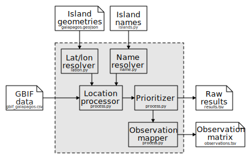

# Galapagos Island Mapper

For analyzing observations of species in the Galapagos from [GBIF](https://www.gbif.org/) data.

## Install

    pip install -r requirements.txt

## Run

This repository includes a small sample data set for testing, but to do the full analysis you will need to obtain a TSV extract of the [GBIF](http://www.gbif.org) data for the Galapagos islands.  Update `config.ini` to point to this data file if necessary, and then run:

    ./analyze.sh

## Architecture

## License

This project redistributes the following in the `data` directory:

  - `ioc-names-14.1.xml`: The [IOC World Bird List](https://www.worldbirdnames.org/new/ioc-lists/master-list-2/) version 14.1 XML, released under a [Creative Commons Attribution](http://creativecommons.org/licenses/by/3.0/deed.en_US) license.
  - `galapagos.geojson`: Galapagos island geometry extracted from [Open Street Map](https://www.openstreetmap.org/), released under the [Open Data Commons Open Database License](https://opendatacommons.org/licenses/odbl/).
  - `gbif-test.tsv`: Sampled species occurrence data in the Galapagos from [GBIF](https://www.gbif.org/), released under various [Creative Commons](https://www.gbif.org/terms) licenses, none being more restrictive than [CC-BY-NC](https://creativecommons.org/licenses/by-nc/4.0/).
